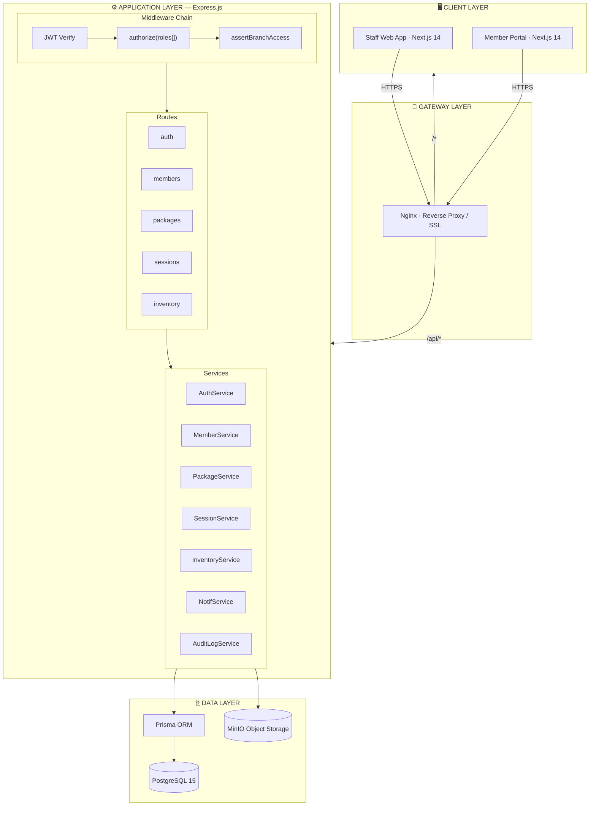
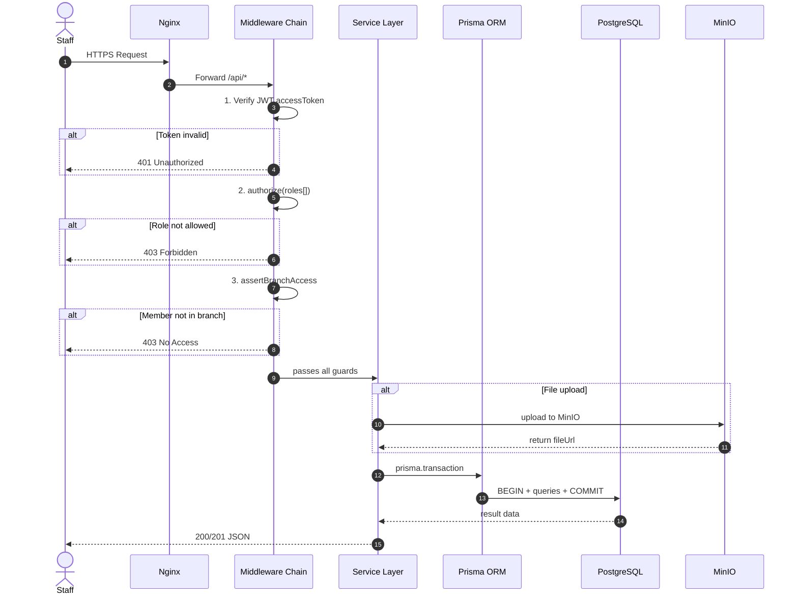
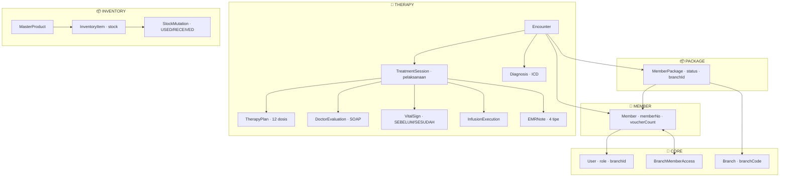
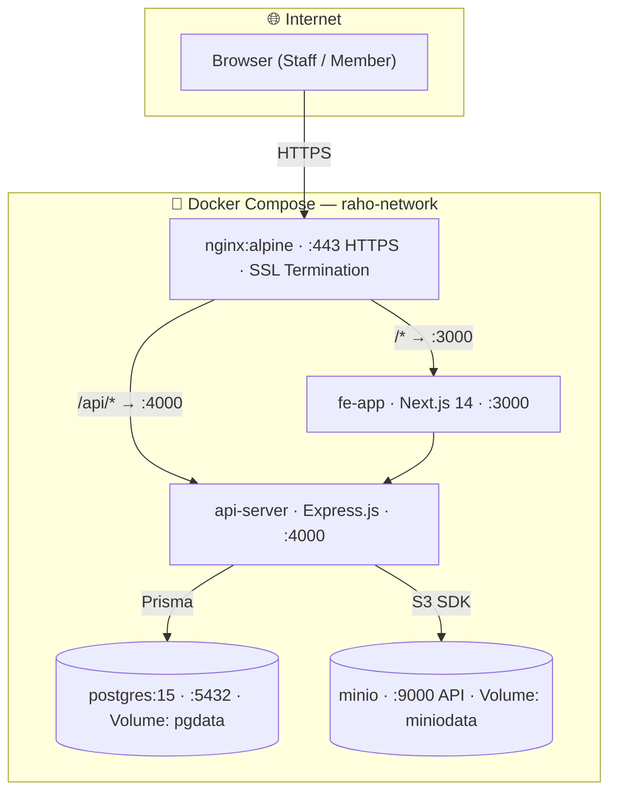

Berikut seluruh **Architecture Modeling RAHO** dalam 4 diagram Mermaid beserta kode lengkapnya:

***
# 
## Diagram 1 — System Architecture (All Tiers)
Sistem RAHO dibangun dalam **5 tier** yang terpisah dengan koneksi yang jelas: [ppl-ai-file-upload.s3.amazonaws](https://ppl-ai-file-upload.s3.amazonaws.com/web/direct-files/attachments/52826684/b8c836b5-bacc-4921-ae1b-5d5a90a604ee/Usecase_ALL.md)

| Tier | Teknologi | Fungsi |
|---|---|---|
| **Client Layer** | Next.js 14 App Router | Staff Web App + Member Portal |
| **Gateway Layer** | Nginx | Reverse proxy, SSL termination, routing `/api/*` vs `/*` |
| **Application Layer** | Express.js | Route handlers, middleware chain, service layer |
| **Data Layer** | PostgreSQL + Prisma + MinIO | Persistence dan object storage |
| **Infrastructure** | Docker Compose | Container orchestration semua komponen |

***
## Diagram 2 — Request Lifecycle (Sequence)
Setiap request melewati **3 middleware berurutan** sebelum sampai ke service layer: [ppl-ai-file-upload.s3.amazonaws](https://ppl-ai-file-upload.s3.amazonaws.com/web/direct-files/attachments/52826684/753c4a7d-c0d1-4bba-a13f-107afb24aeeb/Usecase_AdminLayanan.md)

```
Request masuk
  →  [ppl-ai-file-upload.s3.amazonaws](https://ppl-ai-file-upload.s3.amazonaws.com/web/direct-files/attachments/52826684/b8c836b5-bacc-4921-ae1b-5d5a90a604ee/Usecase_ALL.md) JWT Verify      — validasi accessToken → 401 jika invalid
  →  [ppl-ai-file-upload.s3.amazonaws](https://ppl-ai-file-upload.s3.amazonaws.com/web/direct-files/attachments/52826684/753c4a7d-c0d1-4bba-a13f-107afb24aeeb/Usecase_AdminLayanan.md) authorize([])   — cek role diizinkan   → 403 jika bukan
  → [3] assertBranch    — cek akses ke member  → 403 jika bukan cabang
  → Route Handler → Service → Prisma Transaction → Response
```

Semua operasi yang melibatkan stok, voucher, atau data sensitif berjalan dalam satu **Prisma transaction** — jika satu query gagal, seluruh operasi di-rollback otomatis.

***
## Diagram 3 — Domain Model (6 Bounded Contexts)
Domain dibagi menjadi **6 bounded context** yang terisolasi: [ppl-ai-file-upload.s3.amazonaws](https://ppl-ai-file-upload.s3.amazonaws.com/web/direct-files/attachments/52826684/b8c836b5-bacc-4921-ae1b-5d5a90a604ee/Usecase_ALL.md)

| Domain | Inti Entitas |
|---|---|
| **Core** | `User`, `UserProfile`, `Branch`, `BranchMemberAccess` |
| **Member** | `Member`, `MemberDocument` |
| **Package** | `PackagePricing`, `MemberPackage` |
| **Therapy** | `Encounter` → `Session` → 8 entitas pendataan |
| **Inventory** | `MasterProduct` → `InventoryItem` → `StockMutation` |
| **Communication** | `Notification`, `ChatRoom`, `ChatMessage`, `AuditLog` |

***
## Diagram 4 — Docker Compose Deployment
```yaml
# Ringkasan docker-compose.yml
services:
  nginx:      # Port 443 (HTTPS) + 80 → redirect HTTPS
  fe-app:     # Next.js  — Port 3000 (internal)
  api-server: # Express  — Port 4000 (internal)
  postgres:   # PG 15    — Port 5432 (internal), volume: pgdata
  minio:      # MinIO    — Port 9000 API, 9001 Console, volume: miniodata
```

Nginx memisahkan traffic: request ke `/api/*` diteruskan ke `api-server:4000`, sementara semua route lain ke `fe-app:3000`. Database dan MinIO tidak pernah terekspos ke luar Docker network. [ppl-ai-file-upload.s3.amazonaws](https://ppl-ai-file-upload.s3.amazonaws.com/web/direct-files/attachments/52826684/753c4a7d-c0d1-4bba-a13f-107afb24aeeb/Usecase_AdminLayanan.md)

***
## Kode Mermaid Lengkap
Berikut kode semua diagram yang bisa langsung dipakai di dokumentasi:
### Diagram 1 — System Architecture

### Diagram 2 — Request Lifecycle

### Diagram 3 — Domain Model

### Diagram 4 — Docker Deployment
