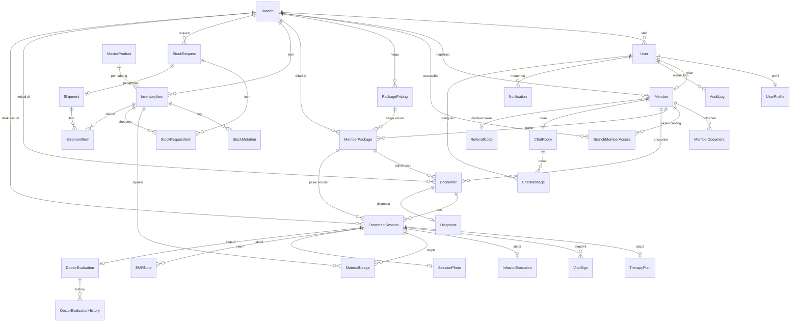

Baik, berikut **Bagian 1** — Core & Member Domain. Konfirmasi setelah selesai review untuk lanjut ke Bagian 2.

***

# 🗄️ Database Schema Design — RAHO
# Bagian 1 of 2 — Core & Member Domain

> **Konvensi:**
> - Semua PK menggunakan `CUID` (bukan UUID/autoincrement) — URL-safe, tidak sequential (keamanan)
> - Semua timestamp: `createdAt` (auto), `updatedAt` (auto)
> - `isActive` untuk soft-delete — tidak ada hard delete kecuali yang eksplisit
> - Tipe Prisma ditulis di kolom Type, diikuti SQL equivalent

***

## 1. Enum Definitions

```prisma
enum Role {
  SUPER_ADMIN
  ADMIN_MANAGER
  ADMIN_CABANG
  ADMIN_LAYANAN
  DOCTOR
  NURSE
  MEMBER
}

enum BranchType {
  KLINIK
  HOMECARE
}

enum Gender {
  L
  P
}

enum DocumentType {
  PERSETUJUAN_SETELAH_PENJELASAN   // PSP / Informed Consent
  FOTO_PROFIL
}

enum ReferrerType {
  DOKTER
  MEMBER
  MEDIA
  LAINNYA
}
```

***

## 2. Tabel `Branch`

```
Deskripsi: Master data cabang klinik RAHO
```

```prisma
model Branch {
  id            String      @id @default(cuid())
  branchCode    String      @unique          // "PST" = Pusat, "BDG" = Bandung
  name          String
  address       String?
  city          String?
  phone         String?
  type          BranchType  @default(KLINIK)
  operatingHours String?                    // "08:00 - 20:00"
  isActive      Boolean     @default(true)
  createdAt     DateTime    @default(now())
  updatedAt     DateTime    @updatedAt

  // Relations
  users               User[]
  members             Member[]
  branchMemberAccess  BranchMemberAccess[]
  memberPackages      MemberPackage[]
  packagePricings     PackagePricing[]
  inventoryItems      InventoryItem[]
  stockRequests       StockRequest[]
  shipmentsFrom       Shipment[]  @relation("ShipmentFrom")
  shipmentsTo         Shipment[]  @relation("ShipmentTo")
  encounters          Encounter[]
  treatmentSessions   TreatmentSession[]

  @@index([branchCode])
  @@index([isActive])
}
```

```
Index Strategy:
  branchCode  → lookup saat generate memberNo, sessionCode, packageCode
  isActive    → filter cabang aktif di dropdown form
```

***

## 3. Tabel `User`

```
Deskripsi: Akun login semua role (staff + member)
```

```prisma
model User {
  id          String    @id @default(cuid())
  email       String    @unique
  password    String                         // bcrypt hash, cost=12
  role        Role
  staffCode   String?   @unique             // "AL-20260410-X9KZ" — null untuk MEMBER
  branchId    String?                        // null untuk SUPER_ADMIN & ADMIN_MANAGER
  isActive    Boolean   @default(true)
  lastLoginAt DateTime?
  createdAt   DateTime  @default(now())
  updatedAt   DateTime  @updatedAt

  // Relations
  branch          Branch?         @relation(fields: [branchId], references: [id])
  profile         UserProfile?
  member          Member?
  auditLogs       AuditLog[]
  notifications   Notification[]
  chatMessages    ChatMessage[]
  chatRooms       ChatRoom[]      @relation("ChatRoomStaff")

  // Sesi sebagai PIC
  sessionsAsAdmin   TreatmentSession[]  @relation("SessionAdmin")
  sessionsAsDoctor  TreatmentSession[]  @relation("SessionDoctor")
  sessionsAsNurse   TreatmentSession[]  @relation("SessionNurse")

  @@index([email])
  @@index([role])
  @@index([branchId, role, isActive])    // query dropdown: tampilkan DOCTOR aktif di cabang X
  @@index([staffCode])
}
```

```
Index Strategy:
  email              → login lookup (paling sering)
  role               → filter user per role di settings
  branchId+role+isActive → dropdown pilih dokter/nakes saat buat sesi
  staffCode          → lookup verifikasi kode unik staff
```

***

## 4. Tabel `UserProfile`

```
Deskripsi: Data profil detail (dipisah dari User agar tabel User ringan)
           Berlaku untuk semua role termasuk MEMBER
```

```prisma
model UserProfile {
  id        String  @id @default(cuid())
  userId    String  @unique
  fullName  String
  phone     String?
  avatarUrl String?           // MinIO URL foto profil (untuk staff)
  createdAt DateTime @default(now())
  updatedAt DateTime @updatedAt

  user User @relation(fields: [userId], references: [id], onDelete: Cascade)

  @@index([fullName])         // search by name di member list
}
```

***

## 5. Tabel `Member`

```
Deskripsi: Data klinis & administratif member
           1-to-1 dengan User (role: MEMBER)
```

```prisma
model Member {
  id               String    @id @default(cuid())
  userId           String    @unique
  memberNo         String    @unique        // "MBR-PST-2604-00001"
  registrationBranchId String             // cabang tempat mendaftar
  referralCodeId   String?                 // FK ke ReferralCode
  voucherCount     Int       @default(0)   // total sesi aktif tersisa
  isConsentToPhoto Boolean   @default(true)

  // Data pribadi
  nik              String?   @unique
  tempatLahir      String?
  dateOfBirth      DateTime?
  jenisKelamin     Gender?
  address          String?
  pekerjaan        String?
  statusNikah      String?
  emergencyContact String?
  sumberInfoRaho   String?
  postalCode       String?

  isActive         Boolean   @default(true)
  createdAt        DateTime  @default(now())
  updatedAt        DateTime  @updatedAt

  // Relations
  user                 User                 @relation(fields: [userId], references: [id])
  registrationBranch   Branch               @relation(fields: [registrationBranchId], references: [id])
  referralCode         ReferralCode?        @relation(fields: [referralCodeId], references: [id])
  documents            MemberDocument[]
  branchAccesses       BranchMemberAccess[]
  memberPackages       MemberPackage[]
  encounters           Encounter[]
  chatRoom             ChatRoom?

  @@index([memberNo])
  @@index([registrationBranchId, isActive])
  @@index([referralCodeId])
  @@index([nik])
  @@index([voucherCount])               // filter member dengan voucher tersisa
}
```

```
Index Strategy:
  memberNo                   → search utama di member list
  registrationBranchId+isActive → query member aktif per cabang
  referralCodeId             → count penggunaan per referrer (WF-14)
  nik                        → validasi duplikasi NIK saat daftar
  voucherCount               → guard sebelum buat sesi (voucherCount > 0)
```

***

## 6. Tabel `MemberDocument`

```
Deskripsi: Dokumen upload member (PSP, foto profil)
           File disimpan di MinIO, hanya URL yang ada di DB
```

```prisma
model MemberDocument {
  id           String       @id @default(cuid())
  memberId     String
  documentType DocumentType
  fileUrl      String                    // MinIO presigned / permanent URL
  fileName     String                    // original filename
  fileSize     Int                       // bytes
  mimeType     String                    // "image/jpeg"
  uploadedBy   String                    // userId yang upload
  createdAt    DateTime     @default(now())

  member Member @relation(fields: [memberId], references: [id], onDelete: Cascade)

  @@index([memberId, documentType])     // fetch semua dokumen member sekaligus
}
```

```
Index Strategy:
  memberId+documentType → fetch dokumen spesifik (misal hanya PSP)
                          tanpa scan seluruh dokumen member
```

***

## 7. Tabel `BranchMemberAccess`

```
Deskripsi: Grant akses member ke cabang selain cabang registrasi
           Tanpa record ini, staff cabang lain tidak bisa lihat member
```

```prisma
model BranchMemberAccess {
  id        String   @id @default(cuid())
  memberId  String
  branchId  String
  grantedBy String              // userId staff yang grant
  notes     String?
  createdAt DateTime @default(now())

  member  Member  @relation(fields: [memberId], references: [id])
  branch  Branch  @relation(fields: [branchId], references: [id])

  @@unique([memberId, branchId])         // tidak boleh duplikasi grant
  @@index([branchId])                    // query: siapa saja member di cabang X
  @@index([memberId])                    // query: cabang mana saja yang bisa akses member X
}
```

```
Unique Constraint:
  [memberId, branchId] → FR-02.3: 409 jika akses sudah ada sebelumnya

Index Strategy:
  branchId → member list page: tampilkan semua member accessible di cabang ini
  memberId → profil member: tampilkan badge "Lintas Cabang" jika ada > 0 record
```

***

## 8. Tabel `ReferralCode`

```
Deskripsi: Penanda identitas siapa yang merekomendasikan member
           BUKAN kode diskon — tidak mempengaruhi harga atau alur bisnis
```

```prisma
model ReferralCode {
  id           String       @id @default(cuid())
  code         String       @unique             // "DR-SUSI-001"
  referrerName String                           // "dr. Susi Wijaya"
  referrerType ReferrerType?                    // DOKTER / MEMBER / MEDIA / LAINNYA
  isActive     Boolean      @default(true)
  createdAt    DateTime     @default(now())
  updatedAt    DateTime     @updatedAt

  members Member[]

  @@index([code])
  @@index([isActive])                           // dropdown hanya tampilkan yang aktif
  @@index([referrerType])                       // filter di admin panel
}
```

```
Unique Constraint:
  code → tidak boleh ada kode yang sama

Index Strategy:
  code         → lookup saat validasi referralCode di FR-02.1
  isActive     → dropdown "Direferensikan Oleh" hanya tampilkan aktif
  referrerType → filter di /admin/referral-codes (WF-14)
```

***

## 9. ERD Bagian 1 (Mermaid)

```mermaid
erDiagram
    Branch {
        string id PK
        string branchCode UK
        string name
        string city
        BranchType type
        boolean isActive
    }

    User {
        string id PK
        string email UK
        string password
        Role role
        string staffCode UK
        string branchId FK
        boolean isActive
    }

    UserProfile {
        string id PK
        string userId UK_FK
        string fullName
        string phone
    }

    Member {
        string id PK
        string userId UK_FK
        string memberNo UK
        string registrationBranchId FK
        string referralCodeId FK
        int voucherCount
        string nik UK
        boolean isActive
    }

    MemberDocument {
        string id PK
        string memberId FK
        DocumentType documentType
        string fileUrl
        string uploadedBy
    }

    BranchMemberAccess {
        string id PK
        string memberId FK
        string branchId FK
        string grantedBy
    }

    ReferralCode {
        string id PK
        string code UK
        string referrerName
        ReferrerType referrerType
        boolean isActive
    }

    Branch ||--o{ User : "memiliki"
    Branch ||--o{ Member : "registrasi di"
    Branch ||--o{ BranchMemberAccess : "diakses oleh"
    User ||--|| UserProfile : "punya"
    User ||--o| Member : "akun"
    Member ||--o{ MemberDocument : "punya"
    Member ||--o{ BranchMemberAccess : "punya akses ke"
    Member }o--o| ReferralCode : "direferensikan oleh"
```

***

## 10. Indexing Strategy Summary — Bagian 1

| Tabel | Index | Tipe | Alasan |
|---|---|---|---|
| `Branch` | `branchCode` | Unique | Generate kode member/sesi/paket |
| `Branch` | `isActive` | Regular | Filter dropdown cabang aktif |
| `User` | `email` | Unique | Login lookup |
| `User` | `branchId, role, isActive` | Composite | Dropdown dokter/nakes per cabang |
| `User` | `role` | Regular | Filter user settings |
| `Member` | `memberNo` | Unique | Search utama member list |
| `Member` | `nik` | Unique | Validasi duplikasi NIK |
| `Member` | `registrationBranchId, isActive` | Composite | Member list per cabang |
| `Member` | `referralCodeId` | Regular | Count member per referrer |
| `MemberDocument` | `memberId, documentType` | Composite | Fetch dokumen spesifik |
| `BranchMemberAccess` | `memberId, branchId` | Unique | Guard duplikasi grant akses |
| `BranchMemberAccess` | `branchId` | Regular | Member list lintas cabang |
| `ReferralCode` | `code` | Unique | Validasi kode saat daftar |
| `ReferralCode` | `isActive` | Regular | Dropdown referrer aktif |

***
# 🗄️ Database Schema Design — RAHO
# Bagian 2 of 2 — Package, Therapy, Inventory, Communication & Audit

***

## 10. Enum Tambahan (Bagian 2)

```prisma
enum PackageType {
  BASIC
  BOOSTER
}

enum PackageStatus {
  PENDING_PAYMENT
  ACTIVE
  EXPIRED
  CANCELLED
}

enum BoosterType {
  NO           // Nitrogen Oksida
  GASSOTRAUS
}

enum SessionStatus {
  COMPLETED
}

enum SessionType {
  ON_SITE
  HOME_CARE
}

enum EncounterStatus {
  ONGOING
  CLOSED
}

enum VitalType {
  SISTOL
  DIASTOL
  HR
  SATURASI
  PI
}

enum VitalTiming {
  SEBELUM
  SESUDAH
}

enum BottleType {
  IFA
  EDTA
}

enum EMRNoteType {
  CLINICAL_NOTE
  OPERATIONAL_NOTE
  ASSESSMENT
  OUTCOME_MONITORING
}

enum DiagnosisCategory {
  HIPERTENSI
  NEUROLOGI
  DIABETES
  KARDIOVASKULAR
  ORTOPEDI
  IMUNOLOGI
  HEMATOLOGI
  LAINNYA
}

enum ProductCategory {
  MEDICINE
  DEVICE
  CONSUMABLE
}

enum StockMutationType {
  USED
  RECEIVED
  ADJUSTMENT
}

enum StockRequestStatus {
  PENDING
  APPROVED
  REJECTED
}

enum ShipmentStatus {
  PREPARING
  SHIPPED
  RECEIVED
  APPROVED
}

enum NotificationType {
  INVOICE
  REMINDER
  INFO
}

enum NotificationStatus {
  UNREAD
  READ
}
```

***

## 11. Package Domain

### Tabel `PackagePricing`

```
Deskripsi: Master harga paket per cabang
           Dikelola oleh ADMIN_MANAGER & SUPER_ADMIN
```

```prisma
model PackagePricing {
  id            String      @id @default(cuid())
  branchId      String
  packageType   PackageType
  name          String                    // "Basic 7 Sesi"
  totalSessions Int
  price         Decimal     @db.Decimal(12, 2)
  isActive      Boolean     @default(true)
  createdAt     DateTime    @default(now())
  updatedAt     DateTime    @updatedAt

  branch         Branch          @relation(fields: [branchId], references: [id])
  memberPackages MemberPackage[]

  @@unique([branchId, packageType, totalSessions])   // tidak boleh duplikasi paket di cabang
  @@index([branchId, isActive])                      // dropdown assign paket per cabang
  @@index([packageType])
}
```

```
Unique Constraint:
  [branchId, packageType, totalSessions]
  → NFR-02: 1 cabang tidak bisa punya 2 harga untuk "Basic 7 Sesi"

Index Strategy:
  branchId+isActive → dropdown assign paket: hanya paket aktif cabang ini
  packageType       → filter BASIC / BOOSTER di settings harga
```

***

### Tabel `MemberPackage`

```
Deskripsi: Paket yang sudah di-assign ke member
           Satu member bisa punya banyak paket (history)
```

```prisma
model MemberPackage {
  id                  String        @id @default(cuid())
  packageCode         String        @unique       // "PKG-PST-BSC-2604-XY9A1"
  memberId            String
  branchId            String                       // cabang tempat beli — paket locked di sini
  packagePricingId    String?                      // null jika custom
  packageType         PackageType
  totalSessions       Int
  usedSessions        Int           @default(0)
  finalPrice          Decimal       @db.Decimal(12, 2)
  discountPercent     Decimal?      @db.Decimal(5, 2)
  discountAmount      Decimal?      @db.Decimal(12, 2)
  discountNote        String?
  notes               String?
  status              PackageStatus @default(PENDING_PAYMENT)
  boosterType         BoosterType?  // null untuk BASIC; dipilih saat sesi
  assignedBy          String        // userId staff yang assign
  verifiedBy          String?       // userId staff yang verifikasi
  paidAt              DateTime?
  verifiedAt          DateTime?
  activatedAt         DateTime?
  expiredAt           DateTime?
  createdAt           DateTime      @default(now())
  updatedAt           DateTime      @updatedAt

  member          Member          @relation(fields: [memberId], references: [id])
  branch          Branch          @relation(fields: [branchId], references: [id])
  packagePricing  PackagePricing? @relation(fields: [packagePricingId], references: [id])
  encounters      Encounter[]     @relation("EncounterBasicPackage")
  boosterSessions TreatmentSession[] @relation("SessionBoosterPackage")

  @@index([memberId, status])              // tab paket member: filter ACTIVE
  @@index([branchId, status])              // dashboard AC: paket pending verifikasi
  @@index([packageCode])                   // lookup by code
  @@index([memberId, packageType, status]) // guard: cek ada BASIC ACTIVE sebelum buat sesi
}
```

```
Index Strategy:
  memberId+status              → tab Paket di member detail
  branchId+status              → dashboard: badge "N Paket Pending"
  memberId+packageType+status  → guard buat sesi: ada BASIC ACTIVE?
  packageCode                  → lookup direct by code
```

***

## 12. Therapy Domain

### Tabel `Encounter`

```
Deskripsi: Satu episode perawatan untuk satu paket BASIC
           Bisa punya banyak TreatmentSession (infus ke-1, ke-2, dst)
```

```prisma
model Encounter {
  id               String          @id @default(cuid())
  encounterCode    String          @unique     // "ENC-PST-2604-AB3Z9"
  memberId         String
  branchId         String
  memberPackageId  String                      // BASIC package yang dipakai
  adminLayananId   String
  doctorId         String
  nurseId          String
  status           EncounterStatus @default(ONGOING)
  createdAt        DateTime        @default(now())
  updatedAt        DateTime        @updatedAt

  member          Member          @relation(fields: [memberId], references: [id])
  branch          Branch          @relation(fields: [branchId], references: [id])
  memberPackage   MemberPackage   @relation("EncounterBasicPackage", fields: [memberPackageId], references: [id])
  diagnoses       Diagnosis[]
  sessions        TreatmentSession[]

  @@index([memberId, status])            // tab sesi member: ONGOING encounters
  @@index([branchId, status])            // dashboard: encounter aktif di cabang
  @@index([memberPackageId])             // lookup encounter by paket
  @@index([doctorId])                    // filter by dokter
}
```

***

### Tabel `TreatmentSession`

```
Deskripsi: Satu sesi infus (infus ke-N dalam encounter)
           Step lock 1-10 ditrack via relasi ke child tables
```

```prisma
model TreatmentSession {
  id               String        @id @default(cuid())
  sessionCode      String        @unique       // "SES-PST-03-2604-P9QR2"
  encounterId      String
  branchId         String
  infusKe          Int                          // 1, 2, 3, ...
  pelaksanaan      SessionType
  treatmentDate    DateTime
  isCompleted      Boolean @default(false) 
  adminLayananId   String
  doctorId         String
  nurseId          String
  boosterPackageId String?                      // null jika tidak pakai booster
  boosterType      BoosterType?                 // diisi saat Step 4
  createdAt        DateTime      @default(now())
  updatedAt        DateTime      @updatedAt

  encounter       Encounter        @relation(fields: [encounterId], references: [id])
  branch          Branch           @relation(fields: [branchId], references: [id])
  adminLayanan    User             @relation("SessionAdmin",   fields: [adminLayananId], references: [id])
  doctor          User             @relation("SessionDoctor",  fields: [doctorId],         references: [id])
  nurse           User             @relation("SessionNurse",   fields: [nurseId],           references: [id])
  boosterPackage  MemberPackage?   @relation("SessionBoosterPackage", fields: [boosterPackageId], references: [id])

  // Step relations
  therapyPlan     TherapyPlan?
  vitalSigns      VitalSign[]
  infusion        InfusionExecution?
  materials       MaterialUsage[]
  photo           SessionPhoto?
  emrNotes        EMRNote[]
  evaluation      DoctorEvaluation?

  @@index([encounterId])
  @@index([branchId, status])               // dashboard: sesi hari ini
  @@index([branchId, treatmentDate])        // filter sesi by tanggal
  @@index([doctorId, treatmentDate])        // jadwal per dokter
  @@index([status])
}
```

```
Index Strategy:
  encounterId            → list sesi dalam satu encounter
  branchId+status        → dashboard "Sesi Hari Ini"
  branchId+treatmentDate → kalender/jadwal sesi harian
  doctorId+treatmentDate → jadwal per dokter
```

***

### Tabel `Diagnosis`

```
Deskripsi: Diagnosa dokter — dibuat sekali per Encounter (bukan per sesi)
           Step 1: wajib ada sebelum TherapyPlan bisa dibuat
```

```prisma
model Diagnosis {
  id                      String             @id @default(cuid())
  diagnosisCode           String             @unique    // "DX-PST-2604-00001"
  encounterId             String
  doktorPemeriksa         String             // userId DOCTOR
  diagnosa                String             @db.Text
  kategoriDiagnosa        DiagnosisCategory?
  icdPrimer               String?
  icdSekunder             String?
  icdTersier              String?
  keluhanRiwayatSekarang  String?            @db.Text
  riwayatPenyakitTerdahulu String?           @db.Text
  riwayatSosialKebiasaan  String?            @db.Text
  riwayatPengobatan       String?            @db.Text
  pemeriksaanFisik        String?            @db.Text
  pemeriksaanTambahan     Json?              // [{ key: "...", value: "..." }]
  createdAt               DateTime           @default(now())
  updatedAt               DateTime           @updatedAt

  encounter Encounter @relation(fields: [encounterId], references: [id])

  @@unique([encounterId])                    // satu diagnosa per encounter
  @@index([doktorPemeriksa])
  @@index([kategoriDiagnosa])
}
```

```
Unique Constraint:
  [encounterId] → satu encounter hanya boleh punya satu diagnosa
                  (tombol tambah hilang otomatis setelah submit)
```

***

### Tabel `TherapyPlan`

```
Deskripsi: Rencana 12 dosis infus per sesi — WAJIB sebelum step 3-10
```

```prisma
model TherapyPlan {
  id                 String   @id @default(cuid())
  planCode           String   @unique         // "TP-PST-2604-00001"
  treatmentSessionId String   @unique         // satu plan per sesi
  keterangan         String?  @db.Text

  // 12 bahan infus (ml/mg)
  ifa     Decimal? @db.Decimal(10, 2)  // IFA mg
  hho     Decimal? @db.Decimal(10, 2)  // HHO ml
  h2      Decimal? @db.Decimal(10, 2)
  no      Decimal? @db.Decimal(10, 2)
  gaso    Decimal? @db.Decimal(10, 2)
  o2      Decimal? @db.Decimal(10, 2)
  o3      Decimal? @db.Decimal(10, 2)
  edta    Decimal? @db.Decimal(10, 2)
  mb      Decimal? @db.Decimal(10, 2)
  h2s     Decimal? @db.Decimal(10, 2)
  kcl     Decimal? @db.Decimal(10, 2)
  jmlNb   Decimal? @db.Decimal(10, 2)  // Jml. NB ml

  createdAt DateTime @default(now())
  updatedAt DateTime @updatedAt

  session TreatmentSession @relation(fields: [treatmentSessionId], references: [id])

  @@unique([treatmentSessionId])             // NFR-02: satu plan per sesi
}
```

***

### Tabel `VitalSign`

```
Deskripsi: Tanda vital SEBELUM dan SESUDAH sesi
           5 jenis × 2 waktu = max 10 record per sesi
```

```prisma
model VitalSign {
  id                 String      @id @default(cuid())
  treatmentSessionId String
  pencatatan         VitalType   // SISTOL | DIASTOL | HR | SATURASI | PI
  waktuCatat         VitalTiming // SEBELUM | SESUDAH
  value              Decimal     @db.Decimal(8, 2)
  unit               String?     // "mmHg", "bpm", "%"
  recordedBy         String      // userId
  createdAt          DateTime    @default(now())
  updatedAt          DateTime    @updatedAt

  session TreatmentSession @relation(fields: [treatmentSessionId], references: [id])

  @@unique([treatmentSessionId, pencatatan, waktuCatat])   // NFR-02: no duplicate
  @@index([treatmentSessionId])
}
```

```
Unique Constraint:
  [treatmentSessionId, pencatatan, waktuCatat]
  → tidak bisa input Sistol SEBELUM dua kali dalam satu sesi
```

***

### Tabel `InfusionExecution`

```
Deskripsi: Dosis aktual infus vs rencana (Step 5)
           + info fisik botol, cairan, jarum
```

```prisma
model InfusionExecution {
  id                 String     @id @default(cuid())
  treatmentSessionId String     @unique          // satu per sesi

  // Dosis aktual (mirror field dari TherapyPlan)
  ifa     Decimal? @db.Decimal(10, 2)
  hho     Decimal? @db.Decimal(10, 2)
  h2      Decimal? @db.Decimal(10, 2)
  no      Decimal? @db.Decimal(10, 2)
  gaso    Decimal? @db.Decimal(10, 2)
  o2      Decimal? @db.Decimal(10, 2)
  o3      Decimal? @db.Decimal(10, 2)
  edta    Decimal? @db.Decimal(10, 2)
  mb      Decimal? @db.Decimal(10, 2)
  h2s     Decimal? @db.Decimal(10, 2)
  kcl     Decimal? @db.Decimal(10, 2)
  jmlNb   Decimal? @db.Decimal(10, 2)

  // Catatan deviasi (wajib jika aktual ≠ rencana)
  deviationNotes String? @db.Text

  // Info fisik
  bottleType         BottleType?              // IFA | EDTA
  jenisCairan        String?
  volumeCarrier      Decimal?   @db.Decimal(8, 2)
  jumlahJarum        Int?
  tanggalProduksi    DateTime?
  createdAt          DateTime   @default(now())
  updatedAt          DateTime   @updatedAt

  session TreatmentSession @relation(fields: [treatmentSessionId], references: [id])

  @@unique([treatmentSessionId])             // NFR-02: satu infusion record per sesi
}
```

***

### Tabel `MaterialUsage`

```
Deskripsi: Pemakaian bahan/produk tambahan per sesi (Step 6)
           Satu sesi bisa pakai banyak bahan
```

```prisma
model MaterialUsage {
  id                 String   @id @default(cuid())
  treatmentSessionId String
  inventoryItemId    String
  quantity           Decimal  @db.Decimal(10, 2)
  unit               String   // satuan dari MasterProduct
  recordedBy         String   // userId
  createdAt          DateTime @default(now())

  session       TreatmentSession @relation(fields: [treatmentSessionId], references: [id])
  inventoryItem InventoryItem    @relation(fields: [inventoryItemId], references: [id])

  @@index([treatmentSessionId])          // list bahan per sesi
  @@index([inventoryItemId])             // riwayat pemakaian per item
}
```

***

### Tabel `SessionPhoto`

```
Deskripsi: Satu foto dokumentasi per sesi (Step 7)
           File di MinIO, DB hanya simpan URL
```

```prisma
model SessionPhoto {
  id                 String   @id @default(cuid())
  treatmentSessionId String   @unique          // 1 foto per sesi — NFR-02
  fileUrl            String                    // MinIO URL
  fileName           String
  fileSize           Int                       // bytes
  mimeType           String
  uploadedBy         String                    // userId
  createdAt          DateTime @default(now())

  session TreatmentSession @relation(fields: [treatmentSessionId], references: [id])

  @@unique([treatmentSessionId])             // guard 409 jika upload duplikat
}
```

```
Unique Constraint:
  [treatmentSessionId] → backend guard: 409 "Foto sesi sudah diupload."
                         tombol upload hilang otomatis di frontend
```

***

### Tabel `EMRNote`

```
Deskripsi: Catatan EMR per sesi (Step 9) — 4 tipe tersedia
           Satu sesi bisa punya banyak catatan
```

```prisma
model EMRNote {
  id                 String      @id @default(cuid())
  treatmentSessionId String
  noteType           EMRNoteType
  content            String      @db.Text       // max 5000 karakter
  writtenBy          String      // userId
  createdAt          DateTime    @default(now())
  updatedAt          DateTime    @updatedAt

  session TreatmentSession @relation(fields: [treatmentSessionId], references: [id])

  @@index([treatmentSessionId, noteType])    // grouped by tipe di UI
  @@index([treatmentSessionId])
}
```

***

### Tabel `DoctorEvaluation`

```
Deskripsi: Evaluasi SOAP dokter (Step 10) — satu per sesi
           Menyimpan riwayat perubahan (history) setiap kali diedit
```

```prisma
model DoctorEvaluation {
  id                 String   @id @default(cuid())
  evaluationCode     String   @unique       // "EVL-PST-2604-00001"
  treatmentSessionId String   @unique       // satu evaluasi per sesi
  subjective         String?  @db.Text      // S
  objective          String?  @db.Text      // O
  assessment         String?  @db.Text      // A
  plan               String?  @db.Text      // P
  generalNotes       String?  @db.Text      // Catatan Umum
  writtenBy          String   // userId
  createdAt          DateTime @default(now())
  updatedAt          DateTime @updatedAt

  session  TreatmentSession        @relation(fields: [treatmentSessionId], references: [id])
  history  DoctorEvaluationHistory[]

  @@unique([treatmentSessionId])             // NFR-02: satu evaluasi per sesi
}

model DoctorEvaluationHistory {
  id             String   @id @default(cuid())
  evaluationId   String
  fieldName      String   // "subjective" | "objective" | "assessment" | "plan" | "generalNotes"
  oldValue       String?  @db.Text
  newValue       String?  @db.Text
  changedBy      String   // userId
  createdAt      DateTime @default(now())

  evaluation DoctorEvaluation @relation(fields: [evaluationId], references: [id])

  @@index([evaluationId])                    // accordion riwayat perubahan
}
```

***

## 13. Inventory Domain

### Tabel `MasterProduct`

```
Deskripsi: Katalog produk global — dikelola SUPER_ADMIN
           Tidak terikat ke cabang; InventoryItem yang terikat ke cabang
```

```prisma
model MasterProduct {
  id          String          @id @default(cuid())
  name        String          @unique
  category    ProductCategory
  unit        String                    // "ml", "mg", "pcs"
  description String?
  isActive    Boolean         @default(true)
  createdAt   DateTime        @default(now())
  updatedAt   DateTime        @updatedAt

  inventoryItems InventoryItem[]

  @@index([category, isActive])          // filter dropdown bahan per kategori
  @@index([isActive])
}
```

***

### Tabel `InventoryItem`

```
Deskripsi: Stok produk per cabang
           Satu MasterProduct bisa punya item di banyak cabang
```

```prisma
model InventoryItem {
  id               String   @id @default(cuid())
  masterProductId  String
  branchId         String
  stock            Decimal  @db.Decimal(10, 2)   @default(0)
  minThreshold     Decimal  @db.Decimal(10, 2)   @default(0)
  storageLocation  String?                         // "Rak A3"
  createdAt        DateTime @default(now())
  updatedAt        DateTime @updatedAt

  masterProduct  MasterProduct    @relation(fields: [masterProductId], references: [id])
  branch         Branch           @relation(fields: [branchId], references: [id])
  stockMutations StockMutation[]
  materialUsages MaterialUsage[]
  stockRequestItems StockRequestItem[]

  @@unique([masterProductId, branchId])          // NFR-02: satu item per produk per cabang
  @@index([branchId, stock])                     // filter stok kritis (stock < minThreshold)
  @@index([branchId])                            // inventory list per cabang
}
```

```
Unique Constraint:
  [masterProductId, branchId] → tidak bisa duplikasi item yang sama di cabang yang sama

Index Strategy:
  branchId+stock → query stok kritis: WHERE stock < minThreshold AND branchId = ?
```

***

### Tabel `StockMutation`

```
Deskripsi: Log perubahan stok — append-only (tidak pernah dihapus)
           Dipicu otomatis oleh Step 4, 5, 6 sesi dan approve Shipment
```

```prisma
model StockMutation {
  id              String            @id @default(cuid())
  inventoryItemId String
  type            StockMutationType // USED | RECEIVED | ADJUSTMENT
  quantity        Decimal           @db.Decimal(10, 2)  // selalu positif
  stockBefore     Decimal           @db.Decimal(10, 2)
  stockAfter      Decimal           @db.Decimal(10, 2)
  referenceType   String?           // "TreatmentSession" | "Shipment" | "Manual"
  referenceId     String?           // ID dari sumber mutasi
  notes           String?
  createdBy       String            // userId
  createdAt       DateTime          @default(now())

  inventoryItem InventoryItem @relation(fields: [inventoryItemId], references: [id])

  @@index([inventoryItemId, createdAt])          // riwayat mutasi per item (sort by date)
  @@index([referenceType, referenceId])          // lookup: mutasi dari sesi tertentu
  @@index([type])                                // filter USED / RECEIVED / ADJUSTMENT
  @@index([createdAt])                           // audit timeline
}
```

***

## 14. Procurement Domain

### Tabel `StockRequest`

```
Deskripsi: Request stok dari ADMIN_CABANG ke SUPER_ADMIN
```

```prisma
model StockRequest {
  id         String             @id @default(cuid())
  requestCode String            @unique    // "REQ-PST-2604-00001"
  branchId   String
  requestedBy String            // userId ADMIN_CABANG
  status     StockRequestStatus @default(PENDING)
  notes      String?
  reviewedBy  String?           // userId SA yang approve/reject
  reviewedAt  DateTime?
  reviewNotes String?
  createdAt  DateTime           @default(now())
  updatedAt  DateTime           @updatedAt

  branch    Branch             @relation(fields: [branchId], references: [id])
  items     StockRequestItem[]
  shipment  Shipment?

  @@index([branchId, status])            // list request per cabang per status
  @@index([status])                      // SA dashboard: PENDING requests
}
```

***

### Tabel `StockRequestItem`

```prisma
model StockRequestItem {
  id              String   @id @default(cuid())
  stockRequestId  String
  inventoryItemId String
  requestedQty    Decimal  @db.Decimal(10, 2)
  notes           String?

  stockRequest  StockRequest  @relation(fields: [stockRequestId], references: [id])
  inventoryItem InventoryItem @relation(fields: [inventoryItemId], references: [id])

  @@index([stockRequestId])
}
```

***

### Tabel `Shipment`

```
Deskripsi: Pengiriman stok dari pusat ke cabang
           Dibuat otomatis saat SA approve StockRequest
```

```prisma
model Shipment {
  id             String         @id @default(cuid())
  shipmentCode   String         @unique    // "SHP-PST-BDG-2604-00001"
  stockRequestId String         @unique    // 1 shipment per request
  fromBranchId   String
  toBranchId     String
  status         ShipmentStatus @default(PREPARING)
  shippedAt      DateTime?
  receivedAt     DateTime?
  approvedAt     DateTime?
  approvedBy     String?        // userId ADMIN_CABANG
  notes          String?
  createdAt      DateTime       @default(now())
  updatedAt      DateTime       @updatedAt

  stockRequest  StockRequest   @relation(fields: [stockRequestId], references: [id])
  fromBranch    Branch         @relation("ShipmentFrom", fields: [fromBranchId], references: [id])
  toBranch      Branch         @relation("ShipmentTo",   fields: [toBranchId],   references: [id])
  items         ShipmentItem[]

  @@index([toBranchId, status])          // AC: shipment masuk ke cabangnya
  @@index([status])                      // SA: semua shipment by status
}

model ShipmentItem {
  id              String   @id @default(cuid())
  shipmentId      String
  inventoryItemId String
  sentQty         Decimal  @db.Decimal(10, 2)
  notes           String?

  shipment      Shipment      @relation(fields: [shipmentId], references: [id])
  inventoryItem InventoryItem @relation(fields: [inventoryItemId], references: [id])

  @@index([shipmentId])
}
```

***

## 15. Communication Domain

### Tabel `Notification`

```prisma
model Notification {
  id         String             @id @default(cuid())
  userId     String                              // penerima
  type       NotificationType                    // INVOICE | REMINDER | INFO
  status     NotificationStatus @default(UNREAD)
  title      String
  body       String             @db.Text
  deepLink   String?            // URL tujuan saat klik notif
  sentBy     String?            // userId pengirim (null = sistem)
  readAt     DateTime?
  createdAt  DateTime           @default(now())

  user User @relation(fields: [userId], references: [id])

  @@index([userId, status])              // list notif user: filter UNREAD
  @@index([userId, createdAt])           // sort terbaru
  @@index([userId, type])                // filter by tipe
}
```

***

### Tabel `ChatRoom`

```prisma
model ChatRoom {
  id        String   @id @default(cuid())
  memberId  String   @unique              // satu room per member
  staffId   String?                       // staff yang sedang handle (opsional)
  isActive  Boolean  @default(true)
  createdAt DateTime @default(now())
  updatedAt DateTime @updatedAt

  member   Member        @relation(fields: [memberId], references: [id])
  staff    User?         @relation("ChatRoomStaff", fields: [staffId], references: [id])
  messages ChatMessage[]

  @@index([memberId])
  @@index([staffId])
  @@index([isActive])
}
```

***

### Tabel `ChatMessage`

```prisma
model ChatMessage {
  id         String   @id @default(cuid())
  roomId     String
  senderId   String
  content    String   @db.Text
  fileUrl    String?              // attachment URL (MinIO)
  fileName   String?
  isRead     Boolean  @default(false)
  createdAt  DateTime @default(now())

  room   ChatRoom @relation(fields: [roomId], references: [id])
  sender User     @relation(fields: [senderId], references: [id])

  @@index([roomId, createdAt])           // scroll riwayat chat (sort by time)
  @@index([roomId, isRead])              // unread count per room
}
```

***

## 16. Audit Domain

### Tabel `AuditLog`

```
Deskripsi: Log semua aksi sensitif — append-only, tidak pernah dihapus
           Dipicu oleh setiap CREATE, UPDATE, DELETE, VERIFY
```

```prisma
model AuditLog {
  id          String   @id @default(cuid())
  userId      String
  action      String   // "CREATE" | "UPDATE" | "DELETE" | "VERIFY" | "GRANT_ACCESS"
  resource    String   // "Member" | "TreatmentSession" | "MemberPackage" | ...
  resourceId  String
  meta        Json?    // data sebelum/sesudah perubahan
  ipAddress   String?
  userAgent   String?
  createdAt   DateTime @default(now())

  user User @relation(fields: [userId], references: [id])

  @@index([userId, createdAt])           // filter by user
  @@index([resource, resourceId])        // history per entitas
  @@index([action, createdAt])           // filter by action type
  @@index([createdAt])                   // timeline semua log
}
```

```
Index Strategy:
  userId+createdAt       → filter log by user di admin panel
  resource+resourceId    → "siapa yang ubah Member X?"
  action+createdAt       → filter semua DELETE dalam rentang tanggal
  createdAt              → pagination default (sort terbaru)
```

***

## 17. ERD Lengkap — Semua Domain (Mermaid)



***

## 18. Full Indexing Strategy Summary

### Composite Index — Paling Kritis

| Tabel | Index | Query yang Dilayani |
|---|---|---|
| `User` | `[branchId, role, isActive]` | Dropdown dokter/nakes saat buat sesi |
| `Member` | `[registrationBranchId, isActive]` | Member list per cabang |
| `Member` | `[memberId, packageType, status]` | Guard cek BASIC ACTIVE sebelum buat sesi |
| `MemberPackage` | `[branchId, status]` | Dashboard: badge paket pending |
| `TreatmentSession` | `[branchId, treatmentDate]` | Jadwal sesi harian di dashboard |
| `InventoryItem` | `[branchId, stock]` | Deteksi stok kritis (stock < minThreshold) |
| `StockMutation` | `[inventoryItemId, createdAt]` | Riwayat mutasi per item |
| `Notification` | `[userId, status]` | Unread count polling 60 detik |
| `ChatMessage` | `[roomId, createdAt]` | Scroll riwayat chat |
| `AuditLog` | `[resource, resourceId]` | History perubahan per entitas |

### Unique Constraint — Data Integrity

| Tabel | Constraint | FR/NFR |
|---|---|---|
| `User` | `email` | FR-02.1: 409 duplikasi email |
| `Member` | `memberNo`, `nik` | FR-02.1: 409 duplikasi NIK |
| `BranchMemberAccess` | `[memberId, branchId]` | FR-02.3: 409 akses sudah ada |
| `ReferralCode` | `code` | FR-11: kode unik |
| `PackagePricing` | `[branchId, packageType, totalSessions]` | NFR-02 |
| `Diagnosis` | `[encounterId]` | Sekali per encounter |
| `TherapyPlan` | `[treatmentSessionId]` | NFR-02: sekali per sesi |
| `InfusionExecution` | `[treatmentSessionId]` | NFR-02: sekali per sesi |
| `SessionPhoto` | `[treatmentSessionId]` | Revisi: 1 foto per sesi |
| `DoctorEvaluation` | `[treatmentSessionId]` | NFR-02: sekali per sesi |
| `InventoryItem` | `[masterProductId, branchId]` | NFR-02: 1 item per produk per cabang |
| `VitalSign` | `[sessionId, pencatatan, waktuCatat]` | NFR-02: no duplicate vital |

***

## 19. Prisma Schema File Structure

```
prisma/
├── schema.prisma          ← satu file utama (semua model di sini)
├── migrations/
│   ├── 20260410_init/
│   │   └── migration.sql
│   ├── 20260411_add_referral_name/
│   │   └── migration.sql
│   └── ...
└── seed.ts                ← data awal:
                              - Branch Pusat
                              - Super Admin default
                              - MasterProduct (IFA, HHO, NO, dst)
                              - PackagePricing default
                              - ReferralCode contoh
```

***

